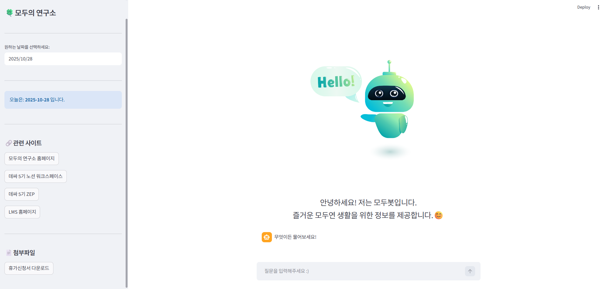

# 모두봇
교육생들의 행정·학습 관련 문의에 답변하는 AI 챗봇 서비스 모두봇입니다. RAG 기반 챗봇과 학습 플랫폼 연계 허브 기능을 제공합니다.

## 1. Overview
KDT 과정에는 다양한 배경과 연령의 교육생들이 참여하며, 온라인 환경에 익숙한 교육생도 있었지만 그렇지 않은 교육생도 다수 존재했습니다.  
이로 인해 수료 조건, 출결, 장려금 등 행정 관련 정보를 일부 교육생은 스스로 잘 찾아볼 수 있었던 반면, 일부 교육생에게는 정보 접근 자체가 어려운 상황이 발생했습니다.

관련 행정 문서는 Notion 내 여러 곳에 분산되어 있었고, 교육생 개개인의 디지털 숙련도 차이로 인해 동일한 정보임에도 불구하고 체감 접근성에는 큰 격차가 있었습니다.  
결과적으로 매니저에게 반복적인 문의가 집중되었고, 비교적 단순한 질문조차 실시간 응대가 어려운 상황이 잦았습니다.

또한 ZEP, Notion, LMS 등 여러 학습 플랫폼을 동시에 사용하면서 플랫폼 간 이동 자체가 학습 흐름을 끊고, 특히 온라인 환경에 익숙하지 않은 교육생에게는 추가적인 진입 장벽으로 작용했습니다.

이를 해결하기 위해 훈련기관 내 행정 문서와 출결 정보를 기반으로 한 RAG 기반 통합 행정 챗봇 **모두봇(Modubot)**을 설계하게 되었습니다. 
모두봇은 단순 질의응답을 넘어, 관련 플랫폼 링크와 행정 서식 파일까지 함께 제공하는 '교육 허브(Hub)' 역할을 수행하며, 교육생 간 정보 접근 격차를 줄이고 운영진의 반복 업무를 경감하는 것을 목표로 설계하였습니다.

## 2. Features
- 자연어 질문 기반 행정 정보 질의응답 (RAG 기반 문서 검색 및 응답 생성)
    - 교육생이 자유롭게 질문하면, 관련 행정 문서를 검색하여 응답을 생성합니다.

- Notion 행정 문서 임베딩 및 벡터 검색  
    - 훈련기관 내 Notion 문서를 임베딩하여 Chroma 기반 검색을 수행합니다.

- 검색 결과 재정렬을 통한 응답 품질 개선  
    - MMR Retriever와 Cohere Rerank를 적용하여 문서 관련도를 향상시켰습니다.

- LLM 입력 컨텍스트 최적화  
  - Long Context Reorder를 적용하여 장문 입력에서도 중요 정보가 양 끝단에 배치되도록 구성했습니다.

- 장문 문맥 대응 대화  
    - Message History를 활용하여 이전 대화 맥락을 유지합니다.

- 플랫폼 이동 링크 제공 
    - 답변과 함께 ZEP, Notion, LMS 등 관련 학습 플랫폼으로 바로 이동할 수 있으며 휴가신청서와 같은 서식 파일을 다운로드 할 수 있습니다.

- 웹 기반 인터페이스  
    - Streamlit 기반 UI를 통해 별도 설치 없이 웹에서 바로 사용할 수 있습니다.

## 3. Data Pipeline
- Notion 문서 수집
- 파일 확장자별 Loader 사용하여 Document 객체로 변환
- textsplitter를 사용하여 문서 청크 분할
    - chunk_size=512
    - chunk_overlap=128
- text-embedding-3-large로 문서 벡터화
    - 고차원 표현이 가능하고 검색 성능이 우수하여 large 모델 채택
    - 데이터 규모가 크지 않아 성능 대비 비용 및 속도 측면에서도 적절하다고 판단
- Chroma에 임베딩 결과 저장
    - 초기 프로토타입 구축 및 로직 검증 속도 확보
    - 오버엔지니어링 방지하고자 Chroma 채택

## 4. System Architecture
- Streamlit을 사용하여 사용자 질의를 입력받는 웹 인터페이스 생성
- Chroma 기반 MMR Retriever로 관련 문서 검색
    - 단순 cosine similarity 대비 속도는 느릴 수 있으나 다양성 고려 가능
    - 문서 특성상 비슷한 단어가 많이 등장하여 다양한 검색 결과를 활용하기 위해 MMR 채택
    - 실험 결과 성능 및 소요 시간을 고려하여 lambda_mult": 0.5, "fetch_k": 50, "k": 25 결정
- Reranker를 통해 검색 결과 재순위화
    - Cohere의 rerank-multilingual-v3.0 모델 사용
    - 순위를 다시 매겨 최종 10개의 검색 결과만 선정
- Reorder를 통해 Reranker 결과 재정렬
    - LLM의 'lost in the middle' 현상을 고려하여 중요한 문서를 양 끝단에 배치
- gpt-4o-mini를 활용한 응답 생성
    - 검색을 제대로 해냈다면 검색 문서의 사실 그대로 답변하도록 추론 능력이 우수한 최신 모델 대신 가격 대비 만족할 만한 답변을 보여준 4o-mini 채택

## 5. Tech Stack
### Language
- Python 3.12

### Framework
- Langchain

### LLM & Embedding
- OpenAI gpt-4o-mini
- OpenAI text-embedding-3-large

### Database
- Chroma

### Frontend
- Streamlit
- Streamlit-Lottie

## 6. Lessons Learned
- 출결 정보처럼 여러 행의 데이터를 모두 종합해야 하는 질문의 경우, 검색 결과가 개별 Document 단위로 전달되면서 LLM이 답변 생성 과정에서 일부 정보를 누락하는 문제가 발생하였습니다. 이는 LLM이 다수의 동질적인 데이터를 요약하려는 특성에서 기인한 것으로, 동일 학생 기준으로 데이터를 groupby하여 하나의 컨텍스트로 재구성함으로써 누락 문제를 해결하였습니다.
- RAG 시스템에서 검색 품질이 전체 응답 품질에 결정적인 영향을 미친다는 점을 확인할 수 있었습니다.
- 단순 cosine similarity search보다 MMR + Rerank 조합이 실제 사용자 질문에 더 안정적인 결과를 제공한다는 것을 확인하였습니다.
